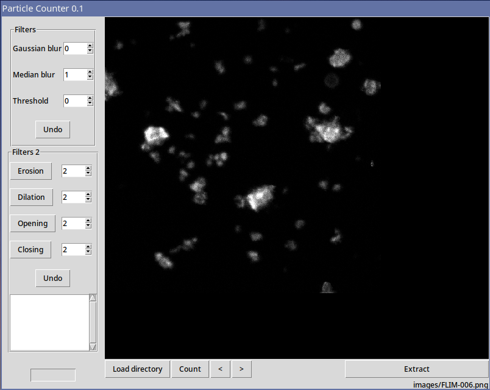

# Micro Particle Counter
A prototype application for segmentation and counting of microparticles in FLIM (Fluorescence-lifetime imaging microscopy) images. Additionally, it extract and preprocess the images for Mask R-CNN machine learning model training.

# Preview

### Installation of required packages ###
    pip install -r requirements.txt
    
### Start App
    python particle_counter_0.1.py